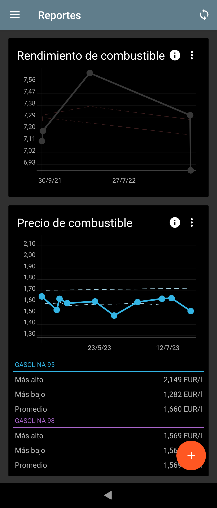
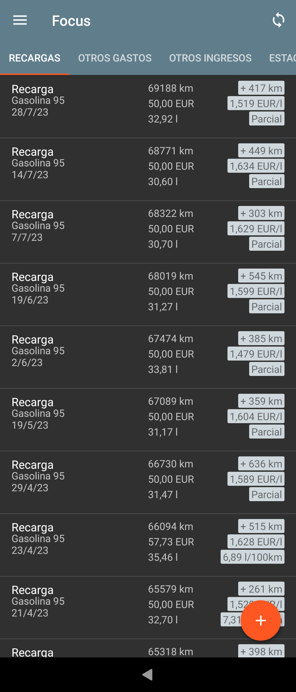
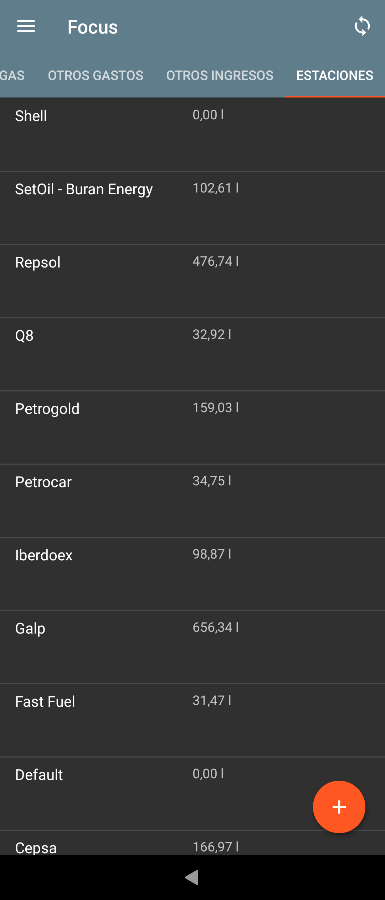
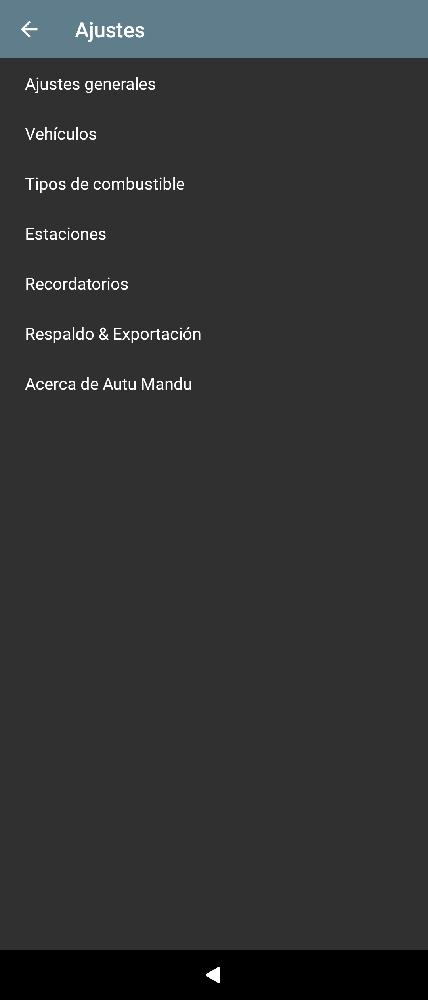

# Autu Mandu
---

| License | Translations | Downloads | Vulnerabilities | Dependences | Bugs | Latest Version |
|---|---|---|---|---|---|---|
| [](https://opensource.org/licenses/Apache-2.0) | [](https://hosted.weblate.org/engage/autu-mandu/?utm_source=widget) | [](https://github.com/juanro49/autu-mandu#install) | [](https://sonarcloud.io/dashboard?id=juanro49_autu-mandu) | [](https://libraries.io/github/juanro49/autu-mandu) | [](https://sonarcloud.io/dashboard?id=juanro49_autu-mandu) |  |

<p>
    
    
    
    
</p>

> Android app for saving and looking up costs of your car.

Autu Mandu (Automobile control in [Extremaduran](https://ext.wikipedia.org/wiki/Lengua_estreme%C3%B1a)) is an android app, based on descontinued [Car Report](https://bitbucket.org/frigus02/car-report) which lets you enter refuelings and other income and expenses of your cars and displays nice reports.

The following options are currently included:
- [x] Fuel consumption between full refuelings
- [x] Fuel price of refueling
- [x] Station of refueling
- [x] Mileage between refuelings
- [x] Costs in general
- [ ] Trip journal
- [ ] Stations map with price

You can add reminders based on mileage and time for car related recurring actions, e.g. general
inspection once a year.

It provides synchronization with webdav and has basic backup/restore and CSV
import/export functionality.

## Translate

You can translate this project using [Weblate](https://hosted.weblate.org/projects/autu-mandu/)

[](https://hosted.weblate.org/engage/autu-mandu/?utm_source=widget)

## Install

[](https://github.com/juanro49/autu-mandu/releases/latest)
[](https://github.com/ImranR98/Obtainium)
[](https://apt.izzysoft.de/fdroid/index/apk/org.juanro.autumandu)
[](https://url.cloud.huawei.com/n83tvRcJmE?shareTo=qrcode)
[](https://autu-mandu.uptodown.com/android)

## Build

The app uses gradle, so to build it just open a command line, switch to the app directory and
execute one of the following commands.

```
# FOSS version
gradle assembleFossRelease
```
## Donations
[](https://coindrop.to/juanro49) [](https://liberapay.com/juanro49/donate) [](https://demo.cesium.app/api/#/v1/payment/5eETo8btrVGYTTyC5nAvqCPmLBok4aRLhxiGP7dy3Wqw?comment=Donaci%C3%B3n%20github)

[](https://github.com/sponsors/juanro49)
[](https://liberapay.com/juanro49)


## Contributors

[](https://github.com/juanro49/autu-mandu/graphs/contributors)


[](https://github.com/juanro49/autu-mandu/graphs/contributors)

## License

[Apache 2.0 © Jan Kühle 2012, Juanro49 2023](../COPYING)
